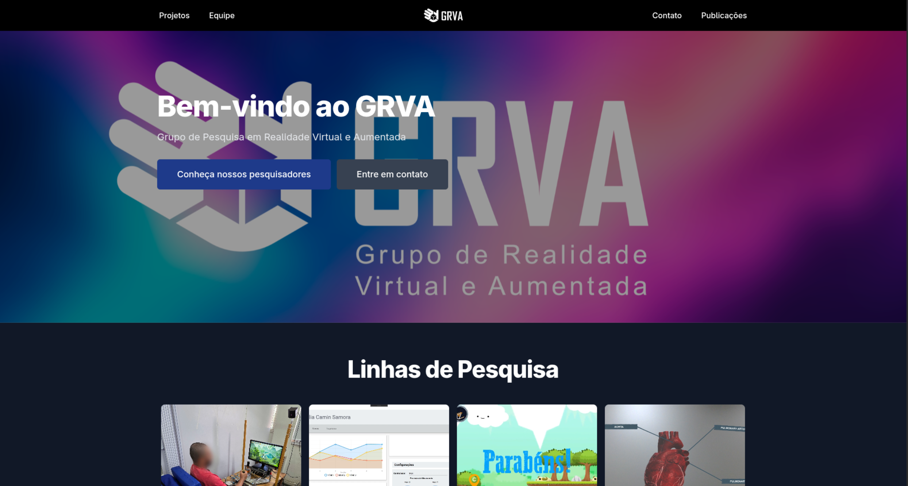
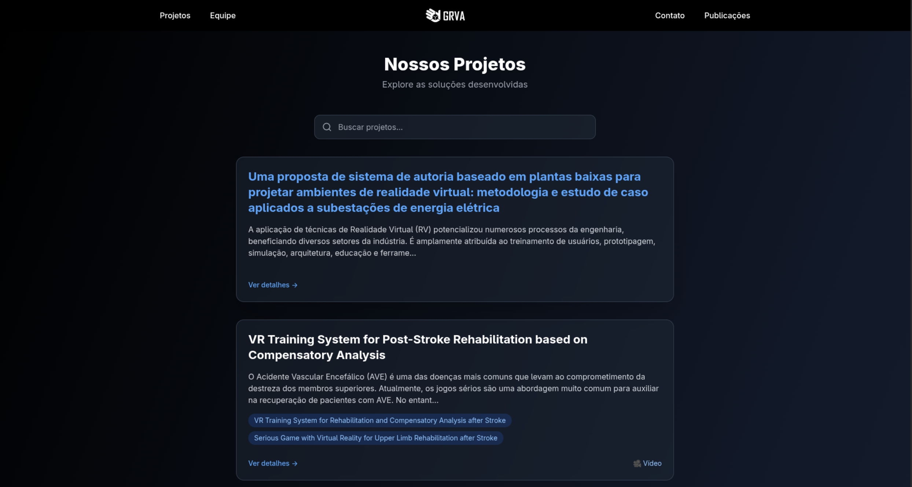
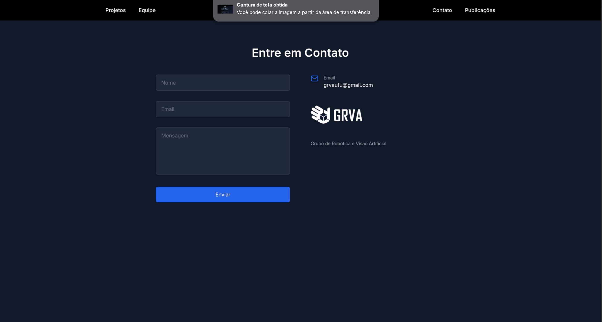
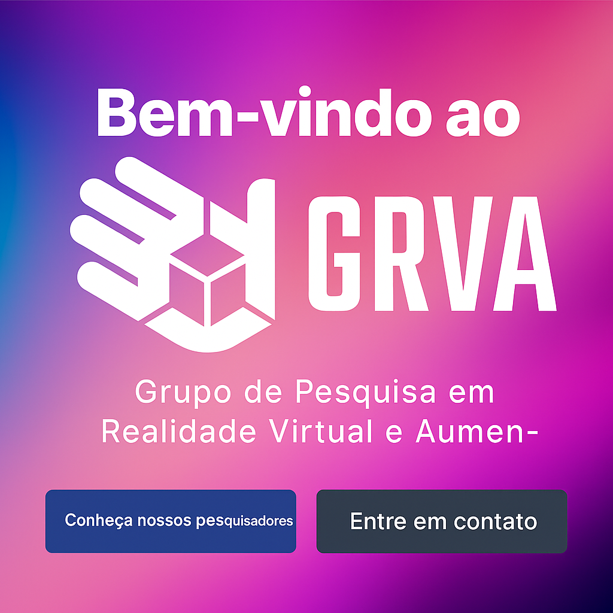

# Vitrine Digital - Grupo de Realidade Virtual e Aumentada (GRVA)

Este repositório contém o código-fonte da plataforma de vitrine digital do **Grupo de Realidade Virtual e Aumentada (GRVA)**. A aplicação foi desenvolvida do zero para servir como um canal de divulgação dos projetos, serviços e pesquisas do laboratório.

O principal objetivo é funcionar como um portfólio dinâmico, atraindo novos talentos, parceiros e oportunidades de negócio.

## 📸 Screenshots

| Página Principal | Seção de Projetos | Página de Contato |
| :---: | :---: | :---: |
|  |  |  |

## 📹 Vídeo de Demonstração

*(Clique na imagem para ver o post completo no LinkedIn)*

## ✨ Funcionalidades Principais

* **Listagem de Projetos:** Uma galeria para exibir os trabalhos e pesquisas desenvolvidos pelo GRVA.
* **Descrição de Serviços:** Apresentação das soluções e consultorias oferecidas pelo laboratório.
* **Atração de Talentos:** Seção "Sobre Nós" e "Faça Parte" para interessados em ingressar no grupo.
* **Canal de Contato:** Formulário direto para contato comercial ou acadêmico.
* **Design Responsivo:** Interface totalmente adaptável para dispositivos móveis e desktops.

## 🚀 Tecnologias Utilizadas

A aplicação foi construída com uma arquitetura moderna, separando o front-end do back-end:

### Front-end
* **[React](https://reactjs.org/)**: Biblioteca para construção da interface de usuário.
* **[TypeScript](https://www.typescriptlang.org/)**: Superset do JavaScript que adiciona tipagem estática.
* **[Tailwind CSS](https://tailwindcss.com/)**: Framework CSS utility-first para estilização rápida e moderna.

### Back-end
* **[Laravel](https://laravel.com/)**: Framework PHP robusto e elegante.
* **[PHP 8](https://www.php.net/)**: Versão da linguagem de programação base.
* **[MySQL](https://www.mysql.com/) / [PostgreSQL](https://www.postgresql.org/)**: Banco de dados relacional (conforme escolha).
